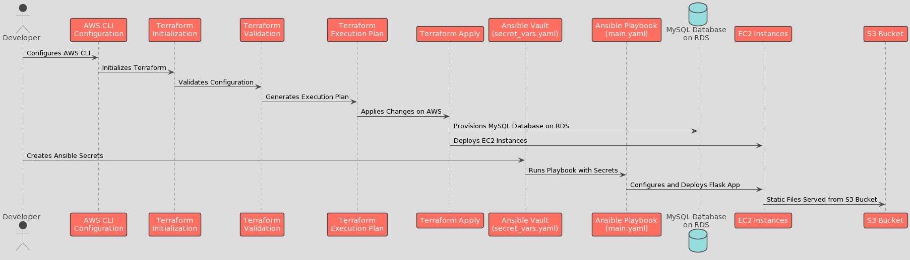
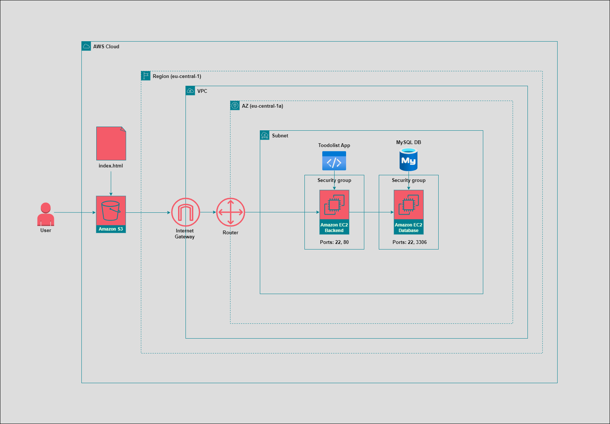

# Flask To-Do List

This guide covers how to deploy the [Flask To-Do List App](https://github.com/chandradeoarya/todolist-flask/tree/env) onto AWS using Terraform and Ansible with MySQL as the database.

## Prerequisites

Before beginning, the following dependencies must be installed:

- [Ansible](https://docs.ansible.com/ansible/latest/installation_guide/intro_installation.html)
- [Terraform](https://developer.hashicorp.com/terraform/tutorials/aws-get-started/install-cli)
- [AWS CLI](https://docs.aws.amazon.com/cli/latest/userguide/getting-started-install.html)
- [Boto3](https://pypi.org/project/boto3/)
- [Botocore](https://pypi.org/project/botocore/)

## Deployment Diagram

This diagram visualizes the deployment process of the Flask To-Do List application, showcasing the sequential steps from AWS CLI configuration to the app launch. It includes the roles of Terraform for infrastructure provisioning and Ansible for configuration management, alongside the utilization of AWS services like EC2 and S3, with MySQL as the backend database. This two step deployment process is later combined using CI/CD.



## Network Diagram

This visualizes the flow of traffic on AWS starting with the user accessing the frontend through an S3 bucket, and the layers the backend traffic goes through to reach the server and database.



## AWS CLI Configuration

Connect the AWS CLI to AWS using the `aws configure` command.

If you are unsure which account the CLI is currently attached to, use the command `aws sts get-caller-identity`

## Permission file

The `stephan.pem` permissions file needs to be placed in the root of the repository.

Next, make sure the file permissions are changed using `chmod 400 stephan.pem`.

## Terraform

### Initialization

`cd` into the terraform directory and run the `terraform init` command. This command initializes Terraform, downloads the required providers, and prepares the environment for further actions.

### Validation

The validate command in Terraform is used to verify the correctness of Terraform configuration files. It checks the syntax of the Terraform files, ensures the correct usage of attributes and values, and validates the configuration based on the core syntax of Terraform and also by checking all the providers in the code.

```sh
terraform validate
```

### Execution Plan

Next, use the `terraform plan` command to  see the changes that Terraform will perform on your AWS environment.

### Apply Changes

To create the resources in AWS, execute `terraform apply`.

## Ansible Vault

The next step is to create the secret .env variables used by Ansible by utilizing Ansible Vault. From the root directory, run the following command:

```sh
ansible-vault create secret_vars.yaml
```

Inside of this file, create two variables:

```
mysql_db_user: "your-user-name"
mysql_db_password: "your-password"
```

If you ever need to go back to this file, you can use the command:

```sh
ansible-vault edit secret_vars.yaml
```

## Ansible Playbook

To provision the EC2 instances, run the main playbook:

```sh
ansible-playbook -i ./inventory/combined_aws_ec2.yaml ./playbooks/main.yaml --ask-vault-pass
```

## Launch the app

Once the playbook is completed, you can view the To-Do list by visiting the [S3](https://s3.console.aws.amazon.com/s3/home?region=eu-central-1#) bucket and clicking on the static hosting link.
